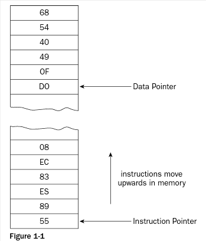
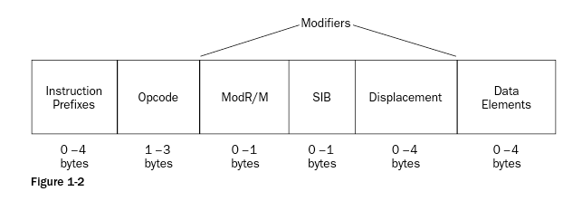

# 处理器指令
## 指令码的处理
汇编的二进制码由制造商在处理器中定义，这些预置的二进制码叫做**指令码**（*instruction code*）。汇编没有统一的格式，不同的芯片都包含了不同的指令码，但对它们的处理方式都类似。处理器芯片一般根据它们所支持的指令码数量和类型进行分类。

指令由指令码构成，指令码会被读到内存中，每条指令都包含了至少一个字节的信息，它们指示处理器执行特定的任务。所有的指令码都从内存读取，指令码所需的数据也从内存中读取，这些数据会预先存到内存里。指令码和数据对于处理器来说没啥区别。

处理器用特殊的**指针**（*pointer*）来区分数据和指令码，并用它来跟踪数据和指令码在内存中的位置。

## 指令码的格式
本书使用Intel IA-32指令码，其格式主要由四部分构成：

   * 指令前缀
   * 操作码
   * 修饰符
   * 数据元素

其中每个部分都只为处理器定义特定的指令。

**操作码：**

IA-32指令只有操作码是必须的部分。每个指令码都必须包含一个操作码，它定义了基本的功能或由处理器处理的任务。操作码的长度为1至3字节，每个操作码都定义了唯一的功能。

**指令前缀：**

指令前缀的长度为1至4字节，它可修改操作码的行为。根据其功能可分为四组，每组中的前缀都只能同时用一种（因此最多只能有四个字节）。它们分别是：

   * 锁定和重复前缀
   * 段覆盖和分支提示前缀
   * 操作数大小覆盖前缀
   * 地址大小覆盖前缀

